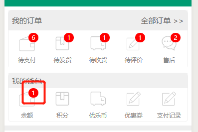

# .badge

```css
.badge {
  position: absolute;
  display: block;
  top: 0;
  right: 15rpx;
  box-sizing: border-box;
  
  min-width: 40rpx;
  padding: 5rpx;
  line-height: 30rpx;
  border-radius: 20rpx;
  font-size: 24rpx;
  
  background-color: red;
  color: white;
  
  text-align: center;
}
```

> 1. 记得要设置 `badge` 的父元素的 `position: ...` 属性要设为relative或者absolute。
> 2. badge最小为 40rpx * 40rpx。

